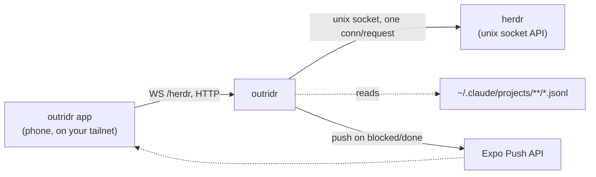

# outridr

Ride flank on your coding agents.

outridr is a single small Node server that exposes a machine running
[herdr](https://herdr.dev) to your tailnet, so the outridr mobile app can
watch and drive your agents from anywhere: **live statuses**, **structured
Claude Code transcripts with full history**, **remote input**, and **push
notifications when an agent needs you**.

[](https://github.com/ohitslaurence/outridr-server/actions/workflows/ci.yml) [](https://www.npmjs.com/package/outridr) [](LICENSE)

## Design

- **Zero dependencies.** Every line of the server is stdlib Node. There is
  nothing to audit but this repo — no transitive supply-chain surface, no
  version-skew breakage from someone else's package.
- **Tailnet-first.** outridr binds to your Tailscale interface, not the
  public internet; your tailnet ACLs are the access-control boundary, and an
  optional shared token is a second factor on top of that.
- **Tested.** Runs on every push and PR across Linux and macOS on Node 20
  and 22 (see the CI badge above).
- **MIT licensed.**

## Quick start

### Prerequisites

- **Node.js ≥ 20** on the machine that will run outridr (`node --version`).
- **[herdr](https://herdr.dev) installed and running.** outridr is a window
  onto herdr — install and start herdr first. This version of outridr needs
  herdr ≥ 0.7.0.
- **[Tailscale](https://tailscale.com)**, signed in on this machine *and* on
  your phone, both on the same tailnet.
- **macOS note**: the `tailscale` CLI isn't on `PATH` by default (Tailscale.app
  from the Mac App Store or a direct download) — it lives at
  `/Applications/Tailscale.app/Contents/MacOS/Tailscale`. outridr's own server
  finds it automatically (see "Configuration" below), but if you alias or
  invoke `tailscale` yourself for the health check below, use the full path or
  add an alias, e.g. `alias tailscale=/Applications/Tailscale.app/Contents/MacOS/Tailscale`.

On the machine running herdr (with Tailscale up):

```sh
npx outridr install     # installs + starts a user service (systemd/launchd)
```

or as a herdr plugin:

```sh
herdr plugin install ohitslaurence/outridr-server
# then run the "outridr: install service" action
```

Check it — on Linux, or macOS with `tailscale` on `PATH`:

```sh
curl "http://$(tailscale ip -4):8674/health"
```

on a stock macOS Tailscale.app install, use the full path instead:

```sh
curl "http://$(/Applications/Tailscale.app/Contents/MacOS/Tailscale ip -4):8674/health"
```

Then point the outridr app at this machine's tailnet hostname. Done.

## Connecting the app

```sh
outridr pair
```

`pair` ensures a strong token exists (generating and saving one the first
time, and reusing it on every later run — it never overwrites an existing
token), resolves the configured host to a concrete address, and prints a
scannable QR code plus the same connection URI as plain text (so it's still
useful when piped, over SSH, or read by a screen reader). Scan the QR with
the outridr app, or paste the URI in — either way, that's the whole pairing
flow.

The URI has the shape:

```
outridr://pair?v=1&host=<host>&port=<port>&token=<token>
```

`v` is the pairing-payload version so the format can evolve compatibly. This
is a contract with the app's deep-link/QR parser — if it ever changes, both
sides need to change together.

**Treat the QR and the URI like a password.** Anyone who has it can connect
to this outridr instance with your token. `pair` never prints the token by
itself outside the URI; don't screenshot or share the QR outside a trusted
pairing.

The QR code is rendered by a small vendored copy of the [Project Nayuki QR
Code generator](https://www.nayuki.io/page/qr-code-generator-library) (MIT
licensed) at `lib/qr.mjs` — the one piece of code in this repo that isn't
original, kept to preserve this project's zero-runtime-dependency design (see
"Design" above). Its MIT copyright header is kept verbatim at the top of the
file.

## How it works



herdr's socket API closes the connection after each response, so outridr
opens one fresh unix connection per request line and multiplexes the
replies back over the app's single long-lived WebSocket, correlated by
request id — the app never has to manage its own pool of socket
connections. Claude Code session transcripts are large, append-only JSONL
files, so outridr never reads a whole one into memory: `/session/<id>`
serves newline-aligned byte-offset windows, letting the app tail new lines
as they're written and separately page backward through history. Push
notifications and the Tailscale IP watch run as background loops alongside
HTTP/WS request handling, in the same process.

## What it serves

| Endpoint | Purpose |
| --- | --- |
| `WS /herdr` | NDJSON session to herdr's socket API. herdr closes its socket after each response, so outridr opens one unix connection per request line and multiplexes replies back over the websocket, correlated by request id. |
| `GET /session/<id>` | Byte-offset windows over a Claude Code session transcript (`~/.claude/projects/**/<id>.jsonl`): tail, forward polling, and backward history pagination. |
| `POST /push/register` | Register an Expo push token. A watcher polls agent statuses and pushes when an agent transitions to `blocked`/`done`. |
| `POST /push/unregister` | Remove a previously registered push token. |
| `GET /health` | Liveness probe (pings herdr through its socket). |
| `GET /repos` † | Built-in scan of your configured root folders for git repos. |
| `GET /repos/roots` | The configured `repos.roots` (empty array if unset). |
| `PUT /repos/roots` ‡ | Set `repos.roots` remotely, for the app's onboarding flow. |

† Opt-in via config, disabled by default.
‡ Requires a configured token — see "Remote configuration" below.

## Configuration

Everything is optional. `~/.config/outridr/config.json`:

```json
{
  "port": 8674,
  "host": "tailscale",
  "token": "optional-shared-secret",
  "herdrSocket": "~/.config/herdr/herdr.sock",
  "repos": { "roots": ["~/Development"], "depth": 2 },
  "push": { "notifyOn": ["blocked", "done"], "pollMs": 5000 }
}
```

Editing this file (or its env overrides) only affects a running service after
you re-run `outridr install` — it restarts the service so the new config
takes effect. See [Service management](#service-management) below.

- `host`: a literal address, or `"tailscale"` to bind the machine's Tailscale
  IPv4 (the default — tailnet-only exposure). Resolving `"tailscale"` shells
  out to `tailscale ip -4`, retrying briefly if it fails (common right after
  boot, before `tailscaled` has an address). If it still can't find one, the
  process exits non-zero rather than silently falling back to a loopback
  bind. While running, outridr also re-checks the Tailscale IPv4
  periodically and exits non-zero if it changed, so a supervisor rebinds it
  to the new address — see [Service management](#service-management) below.
  If you run `outridr serve` in the foreground without a supervisor, know
  that it deliberately exits in both of these cases rather than serving on
  a stale or unreachable address. Binding a non-loopback address with `host`
  set to anything other than `"tailscale"` requires a `token`: outridr
  refuses to start otherwise (see
  [Running without Tailscale](#running-without-tailscale)). On macOS, if the
  `tailscale` CLI isn't on `PATH`, outridr automatically falls back to the
  standard Tailscale.app bundle path
  (`/Applications/Tailscale.app/Contents/MacOS/Tailscale`); override with
  `OUTRIDR_TAILSCALE_BIN` if yours lives somewhere else.
- `token`: optional shared secret, for defense in depth on top of tailnet
  ACLs. Send it as `Authorization: Bearer <token>` on every HTTP request;
  `?token=` is honored only on the `/herdr` WebSocket upgrade (the app can't
  set a header there), so the secret never ends up in URLs, logs, or shell
  history on regular HTTP endpoints.
- `herdrSocket`: path to herdr's unix socket.
- `repos`: absent = `/repos` disabled. When set, `roots` is a list of folders
  to scan (breadth-first, `depth` levels below each root, default `2`) for
  git repos — any directory containing `.git` (a directory or a gitfile, so
  linked worktrees and submodule checkouts count). Scanning does not descend
  into a repo it already found.
- `push`: `notifyOn` is the set of `agent_status` values that trigger a push;
  `pollMs` is the agent-status poll interval.

### Remote configuration

`GET /repos/roots` follows normal auth like every other read — open if you
haven't set a token, gated by it if you have. `PUT /repos/roots` (used by the
app's onboarding flow to configure and live-preview scan roots from the
phone) additionally requires a configured token: a tokenless server refuses
the write with `403 { error: "config-token-required" }` even if the request
would otherwise pass auth, because a tokenless deployment has no way to
distinguish "the app" from "anyone on the tailnet" and letting either rewrite
server config would be a bigger blast radius than the read-only endpoints.
Set a token to enable it. `depth` is not settable remotely — it's file-only
tuning.

### Migrating from 0.3.x

`POST /exec` is gone — the outridr app now creates tasks through herdr's
native `worktree.create`/`agent.start` over `/herdr` instead of shelling out
to a configured CLI. `repos.command` (an external repo-listing command) is
replaced by `repos.roots` (folders for outridr's built-in scanner to walk);
update your config accordingly. Any leftover `exec` or `repos.command` key
is ignored with a startup warning, not a hard failure.

Env overrides (primary):

| Variable | Overrides |
| --- | --- |
| `OUTRIDR_PORT` | `port` |
| `OUTRIDR_HOST` | `host` |
| `OUTRIDR_TOKEN` | `token` |
| `OUTRIDR_CONFIG` | path to the config file itself |
| `HERDR_SOCKET_PATH` | `herdrSocket` |
| `CLAUDE_PROJECTS_DIR` | the Claude Code projects directory transcripts are read from |
| `OUTRIDR_EXPO_PUSH_URL` | the Expo push-send endpoint |

The rest are mostly for tuning/testing and rarely need to change:
`OUTRIDR_STATE_DIR` (where push token state is persisted, default
`~/.local/state/outridr`), `OUTRIDR_RECEIPT_CHECK_MS` (Expo receipts poll
interval, default 900000 = 15 min), `OUTRIDR_HOST_RESOLVE_ATTEMPTS` /
`OUTRIDR_HOST_RESOLVE_DELAY_MS` (boot-time Tailscale IP resolution retries
and delay), `OUTRIDR_HOST_RECHECK_MS` (running IP re-check interval,
default 60000), `OUTRIDR_TAILSCALE_BIN` (path to the `tailscale` binary,
overriding both `PATH` lookup and the macOS app-bundle fallback),
`OUTRIDR_WS_MAX_CONNECTIONS` (max concurrent `/herdr` WebSocket connections,
default 32), `OUTRIDR_WS_IDLE_MS` (idle timeout before an inactive
WebSocket connection is closed, default 600000 = 10 min), and
`OUTRIDR_BIN_DIR` (where `outridr install` writes the CLI launcher, default
`~/.local/bin`).

`outridr config` masks a configured `token` by default; pass `--show-secrets`
to print it in cleartext.

## Security model

Bind to the Tailscale interface and let your tailnet ACLs decide who can
reach outridr — that's the actual perimeter. herdr's own socket has no
auth, so the threat model is simple: anyone who can reach outridr can
drive your agents through it. The optional `token` is a second factor on
top of the tailnet boundary, not a replacement for it.
`repos` only reads directory names and `.git` presence under folders you
configure — it runs no external commands — and is still opt-in: `/repos`
is off unless you set `repos.roots`.
Off the tailnet the perimeter disappears, so outridr enforces the second
factor: a non-loopback bind with a literal `host` refuses to start without
a `token` unless you explicitly set `insecureNoToken: true`.
Binding `0.0.0.0` is only sane behind a firewall or NAT — see
[Running without Tailscale](#running-without-tailscale).

## Running without Tailscale

You don't need Tailscale to use outridr: set `host` to a literal address — a
LAN IP, a WireGuard/ZeroTier interface address, or `0.0.0.0` behind a
firewall/NAT (normal in containers).

A `token` is required for any non-loopback literal bind. Make it long and
random (e.g. `openssl rand -hex 32`) — it's the only lock on the door out
here. The app authenticates with `Authorization: Bearer <token>`.

`?token=` also works for clients that can't set headers, but query strings
end up in reverse-proxy and access logs — prefer the header everywhere you
can.

`insecureNoToken: true` (or env `OUTRIDR_INSECURE_NO_TOKEN=1` for
config-file-less deployments) opts out, for interfaces that already carry
their own auth/encryption boundary (a VPN, an isolated LAN):

```json
{ "host": "0.0.0.0", "insecureNoToken": true }
```

Traffic is plain HTTP. On a network you don't fully trust, put a
TLS-terminating reverse proxy (e.g. Caddy) in front and keep outridr bound
to loopback behind it. Never expose outridr directly to the public internet
— the token gates requests, but it travels in cleartext and there is no
rate limiting.

## Service management

```
outridr serve        Run in the foreground
outridr install      Install + start as a user service (systemd/launchd + linger)
outridr uninstall    Stop and remove the service
outridr status       Service status
outridr config       Print resolved configuration
outridr pair         Generate a token (if needed) and print a QR + URI for the app
```

`outridr install` writes a systemd user unit (Linux, plus `loginctl
enable-linger` so it survives logout) or a launchd agent (macOS, loaded via
`launchctl bootstrap`/removed via `bootout`). Both pin the absolute path of
the *current* `node` binary and this package's entrypoint, so installs
managed by fnm/mise/nvm work under the service manager even though it
doesn't see your shell's version-manager setup. The service restarts on failure: if it
starts before `tailscaled` has an address (common right after boot), it
retries briefly then exits, and the restart brings it back once Tailscale
is up; if the Tailscale IP changes while it's running, it exits so the same
restart mechanism rebinds it to the new address.

If you have a `dev.outridr` launchd agent from an old version of outridr
that used `launchctl load` instead of `bootstrap`, run `outridr uninstall
&& outridr install` once to migrate it to the modern API.

`outridr install` also writes a small launcher script to `~/.local/bin/outridr`
(override with `OUTRIDR_BIN_DIR`), pinned to the same install-time `node`
binary and entrypoint as the service unit — so `outridr pair`/`status`/etc.
keep working from any shell, regardless of which Node version a version
manager has active or auto-switches to in a given directory. If
`~/.local/bin` isn't already on your `PATH`, install prints the line to add
to your shell's rc file; it never edits one for you. `outridr uninstall`
removes the launcher again (only if it's the one outridr wrote).

## Development

```sh
git clone https://github.com/ohitslaurence/outridr-server
cd outridr-server
npm test
```

No install step — zero dependencies means `npm test` works straight out of
`git clone`.

Module layout:

- `lib/server.mjs` — HTTP routing and startup (host resolution, listen)
- `lib/repos.mjs` — built-in git repo scanning + caching for `/repos`
- `lib/session.mjs` — byte-offset transcript windowing for `/session/<id>`
- `lib/websocket.mjs` — minimal RFC6455 server bridging the app to herdr
- `lib/push.mjs` — Expo push token store, status watcher, and send/receipts lifecycle
- `lib/herdr.mjs` — one-request-per-connection herdr socket client
- `lib/http-util.mjs` — shared token auth and request/response helpers
- `lib/service.mjs` — systemd/launchd service install
- `lib/config.mjs` — config file + env override loading
- `lib/config-write.mjs` — validated, atomic config writes (`repos.roots`, `token`)
- `lib/pair.mjs` — `outridr pair`: token + host resolution + connection URI
- `lib/qr.mjs` — vendored MIT QR encoder ([Project Nayuki](https://www.nayuki.io/page/qr-code-generator-library)) + terminal renderer

### How this project is developed

Every non-trivial change here starts as a written plan, is executed against
the test suite, and is human-reviewed before it merges — see
[`plans/`](plans/) for the full engineering record, including plans that
were rejected or deferred and why. Some of that work is done with AI coding
agents under human direction; the plans record is kept precisely so that
process stays auditable rather than opaque.

## License

MIT — see [LICENSE](LICENSE).
